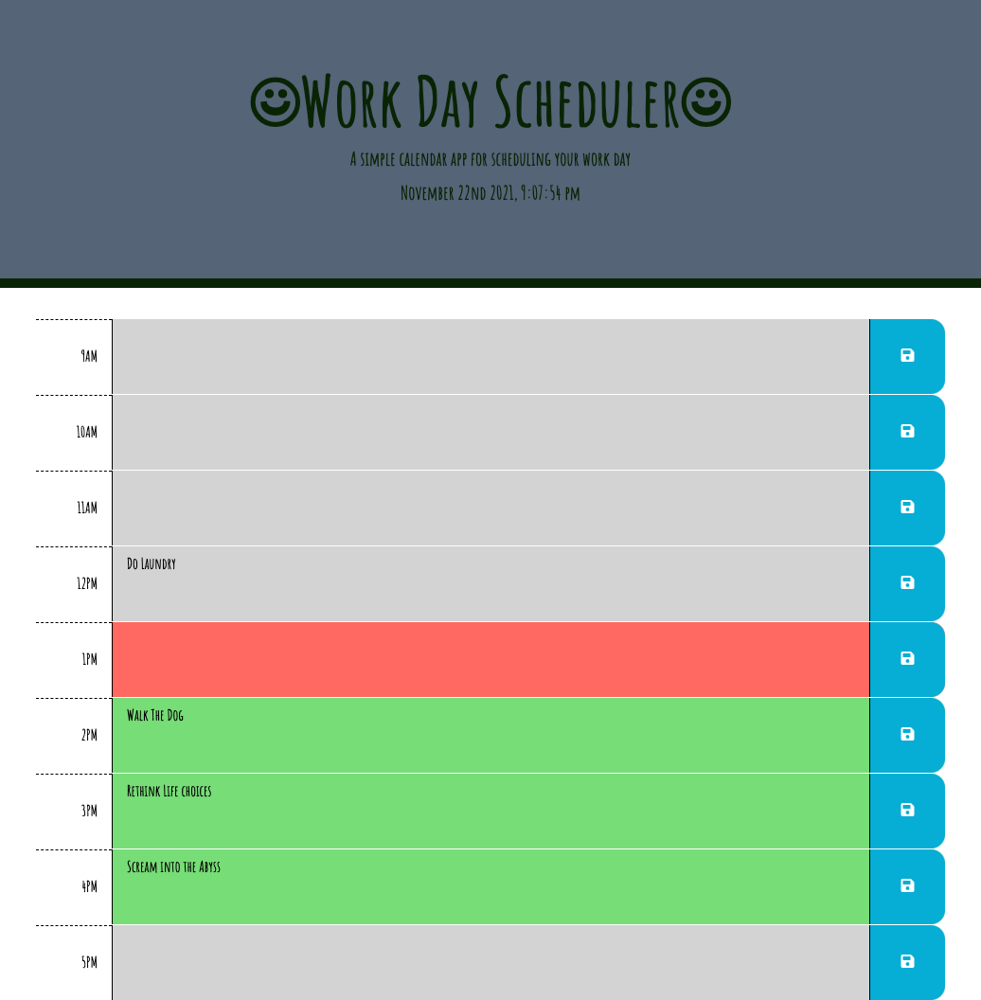

# day-planner
***
### This project was an activity on creating a functioing day-planner. By using moment.js, JQuery, a dynamic day planner was created. Adding items to the schedule and saving them adds to localStorage and make it able to be seen again on refresh.

***

[Day Planner](https://kemwalsh.github.io/day-planner/)